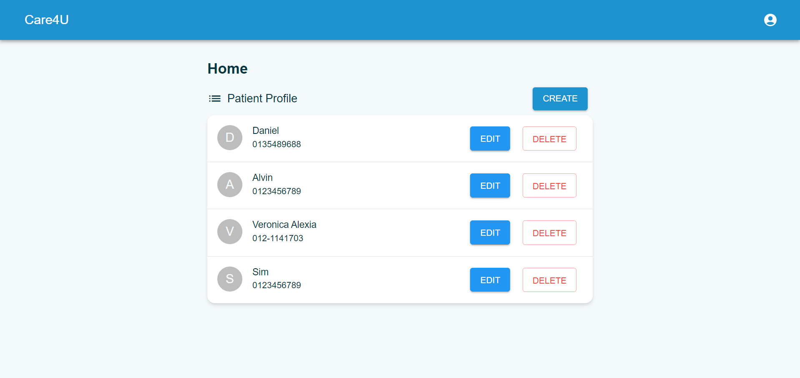
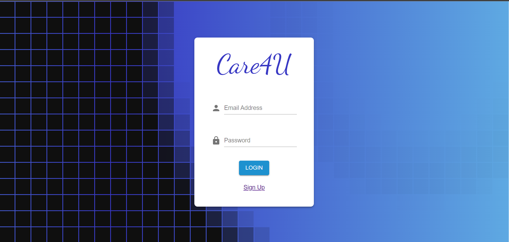

# Care4U

Care4U serves as a healthcare system that allows medical professionals to manage patient information.

## Try it out

Link to application: https://care4u.vercel.app/



## Background

This project was an assignment from WIF3006 Component-Based Software Engineering. We were asked to propose and implement the suitable component model by creating a healthcare system.

## Modules

1. Authentication
2. Manage patient profile
3. Manage medical record

## Functional Requirements

| ID    | Requirements                                                        | Module                 |
| ----- | ------------------------------------------------------------------- | ---------------------- |
| FR-1  | The system must allow users to register accounts.                   | Authentication         |
| FR-2  | The system must allow users to log into their account.              | Authentication         |
| FR-3  | The system must allow users to log out.                             | Authentication         |
| FR-4  | The system must allow users to create patient's profiles.           | Manage Patient Profile |
| FR-5  | The system must allow users to edit patient's profiles.             | Manage Patient Profile |
| FR-6  | The system must allow users to view patient profiles.               | Manage Patient Profile |
| FR-7  | The system must allow users to delete patient profiles.             | Manage Patient Profile |
| FR-8  | The system must allow users to create medical records for patients. | Manage Medical Record  |
| FR-9  | The system must allow users to edit medical records for patients.   | Manage Medical Record  |
| FR-10 | The system must allow users to delete medical records for patients. | Manage Medical Record  |
| FR-11 | The system must allow users to edit medical records for patients.   | Manage Medical Record  |

## Technology stack

- React
- Spring Boot: [Link to repository](https://github.com/HeLinChooi/Care4U-Spring-Boot)
- MySQL
- Vercel
- [Railway](https://railway.app/)

## Development Guide

```
npm install
```

Then

```
npm start
```

to start the react server and develop

> Make sure the Sprnig Boot server and MySQL are running to use the app locally

## Extra Info

The login page is equipped with this swagger effect



https://codepen.io/Hyperplexed/pen/zYWvXMM
